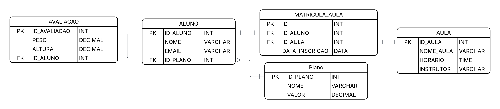

# 🏋️ Sistema de Gestão de Academia (Banco de Dados SQL)

Este projeto consiste na **modelagem conceitual e implementação prática** de um banco de dados relacional para o gerenciamento de uma instituição esportiva. O sistema foi desenvolvido para organizar o fluxo de dados entre alunos, planos de mensalidade, avaliações físicas e aulas coletivas, garantindo a integridade referencial através de chaves estrangeiras (Foreign Keys).

## 📊 Modelagem (DER)

## 💡 Principais Funcionalidades:

* **Controle de Saúde:** Relacionamento **1:1** entre Alunos e Avaliações Físicas, garantindo que cada registro de métricas corporais seja único e vinculado a apenas um estudante.
* **Gestão de Planos:** Relacionamento **1:N** entre Planos e Alunos, permitindo que um plano específico (ex: VIP, Básico) seja compartilhado por múltiplos matriculados.
* **Grade de Atividades:** Relacionamento **N:N** entre Alunos e Aulas, gerenciado por uma tabela associativa que permite a inscrição de diversos alunos em diversas modalidades simultaneamente.

## 🛠️ Tecnologias Utilizadas:

* **MySQL** (SGBD)
* **MySQL Workbench** (Gerenciamento e Queries)
* **Lucidchart** (Modelagem Visual)

---

*Projeto desenvolvido para estudo de fundamentos de bancos de dados relacionais.*
